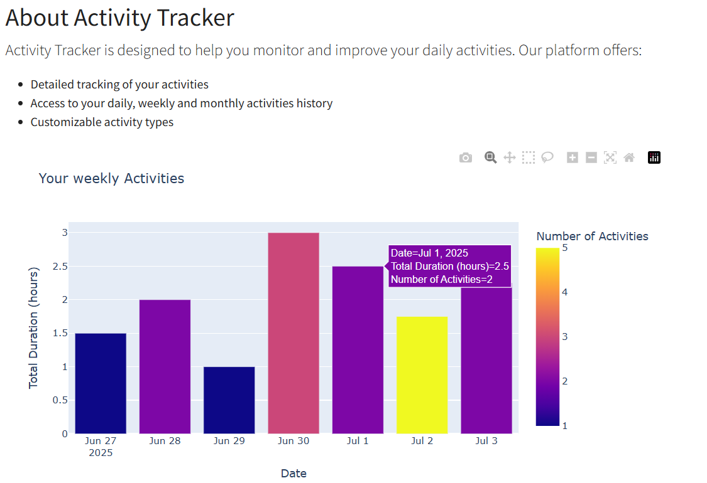

# Activity Tracker

Activity Tracker is a web application for tracking user activities and expenses. Built with Django, PostgreSQL, and containerized using Docker Compose.

## 📸 Screenshots

Here are some screenshots demonstrating the features of the Activity Tracker:

### 1. Weekly Activity Summary



### 2. Track Your Activities


### 3. New Feature: Expense Tracking


## Prerequisites

- Docker
- Docker Compose (v2+ – used via `docker compose` command)
- Docker Desktop or Docker Engine with Docker CLI plugin support

## Getting Started

### Clone the Repository

```bash
git clone https://github.com/Wymagin/Activity_tracker.git
cd Activity_tracker
```
### Generate a Django Secret Key

Before running the application, ensure that you have a unique secret key set in your settings.py file. You can generate a secret key using the following Python script:

```bash
python -c "from django.core.management.utils import get_random_secret_key; print(get_random_secret_key())"
```

Once generated, set the SECRET_KEY environment variable or update the settings.py file directly:

```bash
SECRET_KEY = 'your-generated-secret-key'
```

## Build and Run the Application

### Build the Docker containers and start the application:

```bash
docker compose up --build
```
The application will be available at http://localhost:8000.

### Running Migrations
To apply database migrations, run:

```bash
docker compose run web python manage.py migrate
```

### Creating a Superuser

To create a superuser for accessing the Django admin, run:

```bash
docker compose run web python manage.py createsuperuser
```
### Stopping the Application

To stop the application, run:
```bash
docker compose down
```

## Project Structure

```bash
Activity_tracker/
├── activity_tracker/   # Main Django project
├── Dockerfile          # Dockerfile for the web service
├── docker-compose.yml  # Docker Compose configuration
├── README.md           # Project documentation
└── requirements.txt    # Python dependencies
```


### License
This project is licensed under the MIT License.
